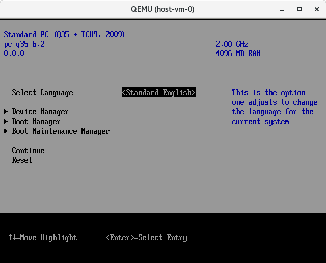
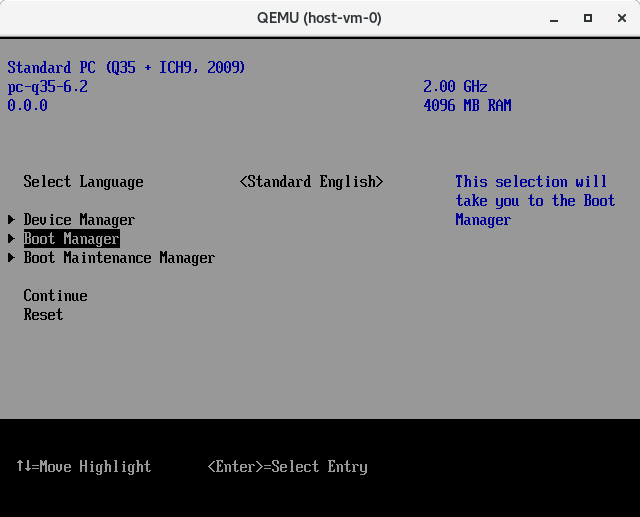
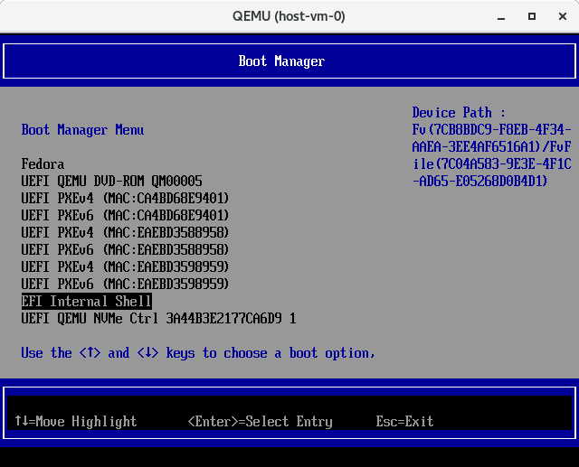
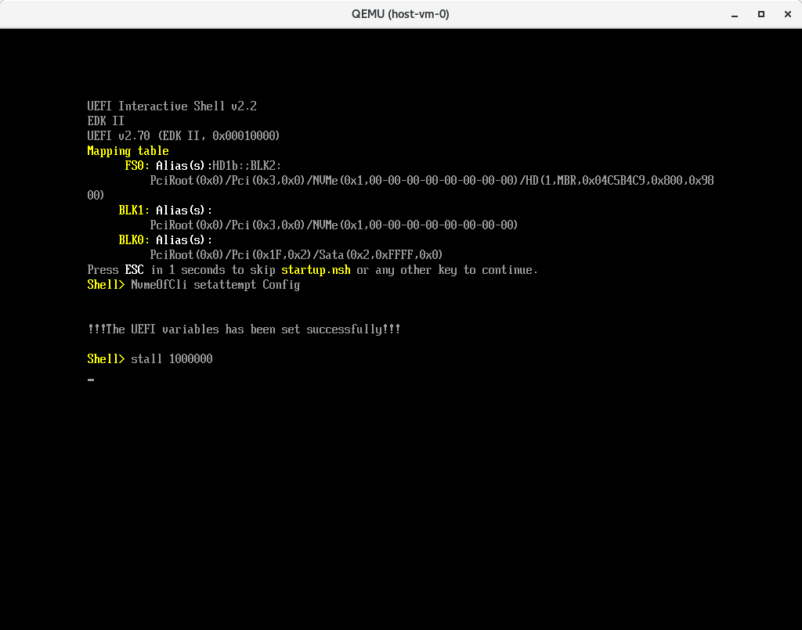
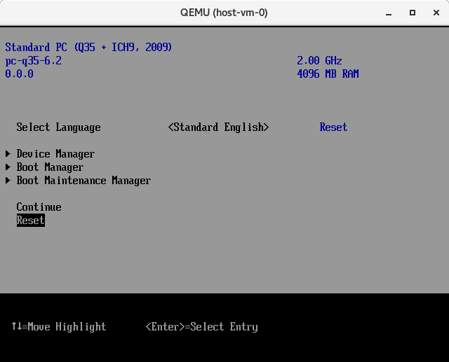
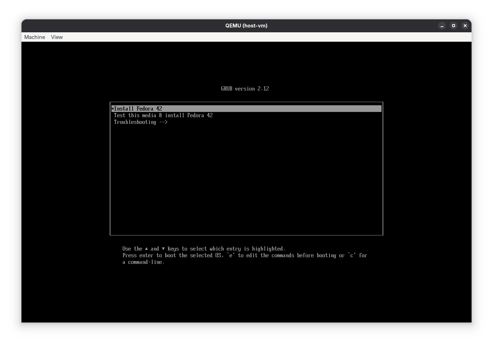
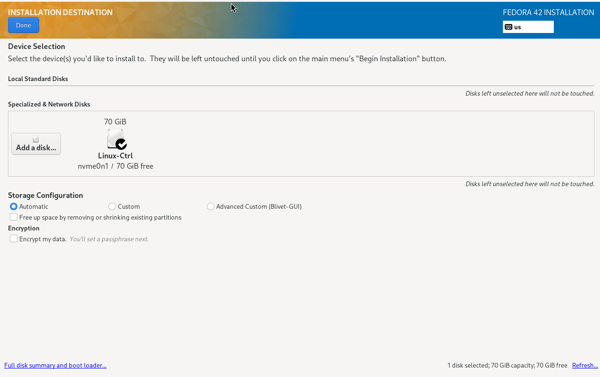

# The Red Hat NVMe/TCP Boot POC

This repository contains packages, scripts and instructions to assit in the set up and deployment of a QEMU based NVMe/TCP boot POC. The prerequisites for this POC include:

1. An X86_64 based hardware platform with 32GB of memory, 12 (VT-x) cores, at least 20GB of spare storage space.
2. A hardwired ethernet connection with access to a DHCP server and the public network.
3. A recent version of Fedora 42 installed on your host - this will be your hypervisor.
4. A user account with with [sudo](https://developers.redhat.com/blog/2018/08/15/how-to-enable-sudo-on-rhel#:~:text=DR%3A%20Basic%20sudo-,TL%3BDR%3A%20Basic%20sudo,out%20and%20back%20in%20again) access so you can administer the hypervisor.
5. (optional) A user account with [git](https://git-scm.com/book/en/v2/Getting-Started-First-Time-Git-Setup) configured so you can modify code.
6. (optional) A valid github login with an [ssh key](https://docs.github.com/en/authentication/connecting-to-github-with-ssh/adding-a-new-ssh-key-to-your-github-account) configured
7. (optional) A valid [copr](https://docs.pagure.org/copr.copr/user_documentation.html#quick-start) account. This requires a [FAS](https://accounts.fedoraproject.org/) account.

This POC was developed on a [ThinkPad T Series
Laptop](https://www.lenovo.com/us/en/c/laptops/thinkpad/thinkpadt) using a
modified version of Fedora 42 with an [upstream QEMU
library](https://www.qemu.org/download/) installed. It's
best to use a current version of Fedora for a hypervisor, if possible.

*NOTE: Only download DVD ISOs. Netinstall ISOs are **not supported**!*

*NOTE: The scripts used in this repository are all designed to be run from
a user account with sudo root access. It is not advised to run these scripts on
a production machine unless you know what you are doing. Some scripts will
modify the configuration of your host computer with sudo access by: installing
packages, creating networks, mounting and unmounting file systems and modifying
some configuration settings in `/etc` and `/usr/libexec`.*

# Quick Start with the prebuilt environment:

1. **Install prerequisites**
  ```
  sudo dnf install -y git unzip mkfs.vfat
  ```

2. **Clone the repository:**
  ```
  git clone https://github.com/timberland-sig/rh-linux-poc.git
  cd ./rh-linux-poc
  ```

3. **If this is your first time downloading this repository, you can simply run:**
  ```
  ./setup.sh quickstart
  ```

It will essentially run the following commands to download and install the *prebuilt* Timberland SIG NVMe/TCP Boot test environment:

```
./setup.sh user   # this will install essential packages - only has to be ran once
./setup.sh virt   # this will install QEMU (only on Fedora) - only has to be ran once
./setup.sh edk2   # this will download and install the Timberland-sig artifacts - only has to be ran once
./setup.sh net    # this will modify your hypervisor network - run this only once
./setup.sh iso    # this will ask for a URL to an ISO file with an OS installer
                  # ↳ may be ran again if you want to try a different distro
                  # ↳ the quickstart only runs this if no ISO was downloaded in this clone of the repository
```

In case of problems consult the [Set up your Hypervisor](#set-up-your-hypervisor) section below.
The next step is to go to [Setup your Virtual Machines](#setup-your-virtual-machines) and install the `host-vm`.

# How it works:

We create two Virtual Machines connected with two virtual networks.  The first
is a NVMe/TCP soft target (`target-vm`), the second is a NVMe/TCP host
(`host-vm`).  On the `host-vm` we will execute the UEFI firmware with QEMU. The
firmware will connect to the nvme1n1 device on the remote `target-vm` with NVMe/TCP,
load the kernel, take over the boot process by using the information provided by the UEFI
firmware via the NBFT table.

```
                                         host-gw
           host-vm               -----------------------             target-vm
     ----------------------      |      hypervisor     |      -------------------------
     |     QEMU+UEFI      |      |                     |      |         QEMU          |
     |                 enp0s4 <--|--- br0 WAN (dhcp) --|--> enp0s4                    |
     |      nvme0n1       |      |                     |      |        nvme0n1        |
     |      EFIDISK       |      |                     |      |    target-vm rootfs   |
     |                    |      |                     |      |                       |
     |  NVMe/TCP host     |      |                     |      |     NVMe/TCP target   |
     |        |        enp0s5 <--| virbr1 LAN (static) |--> enp0s5        |           |
     |        |           |      |                     |      |           |           |
     |     nvme1n1     enp0s6 <--| virbr2 LAN (static) |--> enp0s6     nvme1n1        |
     |     rootfs         |      |                     |      |     host-vm rootfs    |
     |                    |      |                     |      |                       |
     ----------------------      |                     |      -------------------------
                                 -----------------------
```
# Directories and files

Directories and files are explained here:

| Directory | File  | Description |
| :-----   | :----  | :----      |
| `nvme_rpm` |  -  | Contains the git submodule for https://github.com/timberland-sig/nvme-cli. The rpm is generated using this source code with the `nvme-cli.spec` file located in this directory. The code used to generate the rpm can be developed and changed by working in the provided *nvme_rpm/nvme-cli* git repository.  Normal git workflows apply. |
| nvme_rpm | nvme-cli.spec | A modified version of the Fedora nvme-cli.spec file from: https://src.fedoraproject.org/rpms/nvme-cli/blob/rawhide/f/nvme-cli.spec. This spec file has been modified to work with the timberland-sig nvme-cli source code in this submodule.
| `libnvme_rpm` | - | Contains the git submodule for https://github.com/timberland-sig/libnvme. The rpm is generated using this source code with the `libnvme.spec` file located in this directory. The code used to generate the rpm can be developed and changed by working in the provided *libnvme_rpm/libnvme* git repository.  Normal git workflows apply. |
| nvme_rpm | libnvm.spec | A modified version of the Fedora libnvme.spec file from: https://src.fedoraproject.org/rpms/libnvme/blob/rawhide/f/libnvme.spec. This spec file has been modified to work with the timberland-sig libnvme source code in this submodule.
| `dracut_rpm` | - | Contains the git submodule for https://github.com/timberland-sig/dracut. The rpm is generated using this source code with the `dracut.spec` file located in this directory. The code used to generate the rpm can be developed and changed by working in the provided *dracut_rpm/dracut* git repository.  Normal git workflows apply. |
| `dracut_rpm` | dracut.spec | A modified version of the Fedora dracut.spec file from:  https://src.fedoraproject.org/rpms/dracut/blob/rawhide/f/dracut.spec. This spec file has been modified to work with the timberland-sig dracut source code in this submodule. |
|  - | `global_vars.sh` | Contains global variables which control the test bed configuration. If you need to change sometihing, look here first. |
|  - | `rmp_lib.sh` | Contains global functions used by the scripts in the *libnvme_rpm*, *nvme_rpm*, and *dracut_rpm*  subdirectories. |
|  - | `vm_lib.sh` | Contains global functions used by the scripts in the *target-vm* and *host-vm* subdirectories. |
| `host-vm` | - |Contains the scripts and files needed to create and run your QEMU host virtual machine. |
| `target-vm` | - | Contains the scripts and files needed to create and run your QEMU target virtual machine. |

Proposed changes and patches should be sent to the repsective repositories at:
https://github.com/timberland-sig

# Getting Started

Step by step instructions for creating your QEMU Virtual Machines.

## Set up your Hypervisor

Run `./setup.sh user` - This script will install some prerequisite rpms and
validate that your user account is correctly configured.  If this script shows
an error, correct the problem and run it again.

Run `./setup.sh net` - This will modify your hypervisor network configuration and
create three bridged networks. Run this script with caution because it will
change your network config.  You should not run this script from a remote shell
because the 'br0' network will be disconnected and reconfigured by this script.
It is best to run this script from the console login. When in doubt, configure
the bridged networks yourself, manually.`

| Network  | Decription |
| :-----   | :----      |
| `br0`    | A bridged public gateway network that requires DHCP  |
| `virbr1` | a virtual bridged network with the static address `192.168.101.1/24` |
| `virbr2` | a virtual bridged network with the static address `192.168.110.1/24` |

Run `./setup.sh virt` - This script will install the needed qemu-kvm packages
and change the permissions of `/etc/qemu/bridge.conf` and
`/usr/libexec/qemu-bridge-helper`. This will allow qemu to run from your user
account.

*Note: this only works with Fedora and should be run with caution. When in
doubt, install and setup qemu yourself, manually.*

Run `./setup.sh iso` - This script will prompt you to enter a URL of an ISO disk image file.
This file will be downloaded and used for installing an operating system on the virtual machines.

Run `./setup.sh edk2` - This script will download the latest Timberland-SIG release of the EDK2 firmware
and prepare it for use by the `host-vm`. Use `./setup.sh edk2 -s` or `./setup.sh edk2 --source` to build from source instead.

# Setup your Virtual Machines

If your hypervisor is on a remote system, you can use `make <target> QEMU_ARGS="-vnc :<number>"`
argment and connect to the VM console with `vncviewer` on your local machine.

*Note that changing the specfic configuration - in terms of IP and MAC
addresses, HOSTNQNs, etc. can be done by modifying the `global_vars.sh` file.*

Also note that the scripts and `Makefile`s in the `host-vm` and `target-vm` directories are
context sensitive. You can only run these scripts as: `./vm.sh` or
`make <target>` in the directory where they exist.

## Installing Fedora

Each QEMU VM (`host-vm` and `target-vm`) will need to be installed as a part of
the test bed setup.  During the installation process you can use all of the
defaults for installation.  The only change in defaults needs be: *be sure to
create a root account with ssh access*.

| Fedora Install Step  | Action |
| :-----               | :----      |
| **Select Language**  | Click `Continue` |
| **This is unstable, pre-release software**  |  Click `I want to procced` |
| **Installation Destination** | The disk is pre-selected.  Simply Click `Done` |
| **Root Account** | Click `Enable root account` |
| enter Root Password | - [x] Allow root SSH login with password |
| **User Creation** | *Optional: Create a user account if wanted. All POC configuration will use the root account.* |
| final step | Click `Begin installation` |
| **INSTALLATION PROGRESS** | Click `Reboot System` when done|
| Complete the installation | It is important to wait for the VM to cleanly reboot in order to complete the installation. |

After the VM reboots login to the *root* account to be sure everything is
working. The VM should now be reachable through `enp0s4` which is the DHCP
controlled management network on the hypervisor's `br0` bridged network;
`enp0s5` and `enp0s6` are statically configured and unconnected. Use the `ip
-br addr show` and `nmcli dev status` commands to see if the networks are there
and correctly working.

## The ./netsetup.sh script

During the installation of both VMs the `./netsetup.sh` script will be
run.  This script will create a VM specific `netsetup.sh` configuration script and
`scp` it to the newly installed VM.  It is important to specify the `ifname` and
`ipaddr` parameters correctly.

```
 Usage: netsetup.sh <ifname2> <ifname3> <ipaddr>

 Creates creates a network configuration script called .build/netsetup.sh for host-vm

  ifname2  - second vm network interface device name (e.g. ens6)
           - corresponds to virbr1 on the hypervisor host
  ifname3  - third vm network interface device name (e.g. ens7)
           - corresponds to virbr2 on the hypervisor host
  ipaddr - dhcp assigned ipv4 address of host-vm
           - corresponds to br0 on the hypervisor host

 These valuse are obtains from "ip -br address show" after booting host-vm the first time

   E.g.:
          ./netsetup.sh enp0s5 enp0s6 192.168.0.63
          ./netsetup.sh enp0s5 enp0s6 10.16.188.66
```

## Create the `target-vm`

You must `cd ./target-vm` to run the scripts needed to start the `target-vm`.

### Step 1 Install the `target-vm`

#### Method 1 Automated installation (Red Hat family distributions)

If the OS on your downloaded ISO belongs to the Red Hat family, you can install the target VM automatically.
Run `make help` to see all available options, then run:

```
make rh-start
```
to start the VM with the pre-installed disk

**Note**: The automated installation uses the anaconda kickstart configuration produced from in `anaconda-ks.cfg.template`.
You will be asked to provide a `root` password for the `target-vm` at the beginning of the setup.
If you are not running this as root, you will also be asked for **your** `sudo` afterwards. Do not confuse these!

If you are running this on a remote machine, the QEMU console window will not appear while the `target-vm` is auto-installing.
The terminal will be blocked as if it was hanging, but **it is not**. The OS is being installed in the background.
Both a success and a failure will terminate the command, so **DO NOT TERMINATE** it yourself nor interrupt it (with `Ctrl+C` for example)!!!

#### Method 2 Manual installation

For any other distribution or if you prefer manual installation:

- Run `make install` to start a manual installation from an ISO
- Connect to the VM console and complete the OS installation
- **Important**: Create a root account with SSH access during installation
- After installation, reboot and run `make start` to start the VM

Run `make help` to see all available targets and configuration options.

### Step 2 Login to the `target-vm`

Login to the root account on the `target-vm` and display the network configuration.

For example:

```
[root@fedora ~]# ip -br addr
lo               UNKNOWN        127.0.0.1/8 ::1/128
enp0s4           UP             192.168.0.63/24 2601:195:4000:62f:f67c:bf12:3bd0:f4bb/64 fe80::e1e:bd3c:3c79:cfbe/64
enp0s5           UP             fe80::6944:6969:83d:aef1/64
enp0s6           UP             fe80::6e22:d7dd:43f0:5e21/64
```

### Step 3 Run `./netsetup.sh` on the hypervisor

The `./netsetup.sh` utility is ran on the hypervisor in the `target-vm`
directory.  Using the infromation from the `ip -br addr show` command on the
`target-vm`, run the `./netsetup.sh` utility.

For example:

```
> ./netsetup.sh enp0s5 enp0s6 192.168.0.63

 creating .build/netsetup.sh

 creating .build/hosts.txt

 scp  .build/{netsetup.sh,start-tcp-target.sh,hosts.txt,tcp.json} root@192.168.0.63:

root@192.168.0.63's password:
netsetup.sh         100% 1738     4.7MB/s   00:00
hosts.txt           100%  229   959.2KB/s   00:00
start-tcp-target.sh 100%  121   646.0KB/s   00:00
tcp.json            100% 2031    10.3MB/s   00:00

 Login to target-vm/root and run "./netsetup.sh" to complete the VM configuration
```

### Step 4 Run `./netsetup.sh` on the `target-vm`

For example:

```
[root@fedora ~]# ./netsetup.sh
Connection 'enp0s5' (76926070-72ca-467d-a3e2-53999c142020) successfully added.
Connection successfully activated (D-Bus active path: /org/freedesktop/NetworkManager/ActiveConnection/11)
Connection 'enp0s6' (b1b8419f-ace8-48fc-9297-88de304dc53a) successfully added.
Connection successfully activated (D-Bus active path: /org/freedesktop/NetworkManager/ActiveConnection/13)
lo               UNKNOWN        127.0.0.1/8 ::1/128
enp0s4           UP             192.168.0.63/24 2601:195:4000:62f:f67c:bf12:3bd0:f4bb/64 fe80::e1e:bd3c:3c79:cfbe/64
enp0s5           UP             192.168.101.20/24 fe80::22d1:a1a1:af9c:4447/64
enp0s6           UP             192.168.110.20/24 fe80::9d3e:e204:f858:a37/64
Enabling a Copr repository. Please note that this repository is not part
of the main distribution, and quality may vary.
.
.
.
 Run "./start-tcp-target.sh" to start the NVMe/TCP soft target.
 Then run "host-vm/start.sh" on the hypervisor to boot the host-vm with NVMe/TCP
```

### Step 5 Run `start-tcp-target.sh` on the `target-vm`

The following step configures and runs the NVMe/TCP softarget on the
`target-vm`.  Following this step the `target-vm` is now serving the
`host-vm's` boot disk through nvme-tcp.

Example:

```
[root@fedora ~]# ./start-tcp-target.sh
[  570.563169] nvmet: adding nsid 1 to subsystem nqn.2014-08.org.nvmexpress:uuid:0c468c4d-a385-47e0-8299-6e95051277db
[  570.564014] nvmet_tcp: enabling port 1 (192.168.101.20:4420)
[  570.564289] nvmet_tcp: enabling port 2 (192.168.110.20:4420)
Redirecting to /bin/systemctl stop firewalld.service
```

## Create the `host-vm`

You need to `cd` to the `host-vm` directory to create your host virtual machine.

### Step 0 Set up NBFT variables

This step only has to be done
1. if you have freshly cloned this repository (a fresh setup),
2. if the `vm_vars.fd` gets deleted, or
3. after running `make clean-config` or `make reconfig` since you may have changed the attempt configuration.

You need to program the NBFT which is programmed by boot variables held in the `vm_vars.fd` file.
This file is initialized by using the *attempt* arguments.

First run:
```
make setup
```
The setup will show a few prompts with which you can customize the boot attempt configuration.
```
Enable multipath? (y/n):
```
Respond `y` to enable to test with multipath network connection for redundancy.
```
Connection timeout (default: 3000):
```
Hit `Enter` to keep the default value of `3000` or enter a custom value and hit `Enter`.
```
Use discovery NQN? (y/n):
```
Respond `y` to enable discovery NQN.
```
1 -> Set NID to NSUUID=...
2 -> Set NID to NSNGUID=...
n -> Do not set NID.
Set NID? (1/2/n):
```
Respond `1` or `2` to set an NID.

This setup creates a `/boot/efi` `vfat` partiton in the `efidisk`.
This partition is then modified to include the following NBFT boot files.

* `eficonfig/startup.nsh`    - the NVMe-oF Boot startup file, used by NvmeOfCli.efi
* `eficonfig/config`         - the NVMe-oF Boot NBFT Attempt Configuration
* `eficonfig/NvmeOfCli.efi`  - the edk2 build artifact

This `efidisk` is used in this QEMU parameter:
```
-drive file=efidisk,format=raw,if=none,id=NVME1 -device nvme,drive=NVME1,serial=$SN3
```
to program the NBFT in the EFI shell, as you will see below.

Once you connect to the `host-vm` console, you will observe the UEFI boot
process starting.  Immediately press the `ESC` button repeatedly to enter the UEFI setup
menu.



Select the `Boot Manager`.



Select the `EFI Internal Shell` and hit `Enter`.



The `EFI Internal Shell` will run and `NvmeOfCli setattempt Config` will run.
Allow the coutdown to expire so that `startup.nsh` runs.
This will program your NBFT/ACPI table with the information
programmed in the `host-vm/eficonfig/config` attempt file.



After `!!!The UEFI variables has been set successfully!!!` the EFI Shell will
return to the Boot Manager menu. Press ESC and select `Reset` to continue.



The EFI firmware will reset and NVMe/TCP will now be possible.

In case of a first-time setup you may now continue directly to step 1 (install) since a GRUB menu should appear now.
Otherwise shut the VM down and continue to [To restart the host-vm after `shutdown -h`](#to-restart-the-host-vm-after-shutdown--h).

### Step 1 Install an OS for the `host-vm`

If you do not yet have the `host-vm` running, run:
```
make install-remote
```



Hit `Enter`.

Follow the instructions on the screen and install your OS (not necessarily Fedora) on your `host-vm`.

If everything worked correctly, you should see the remote NVMe drive in
the drive selection menu of the installer.
Example from the installation of Fedora:



If you do not see it, it may be hidden in the `Add disk` submenu.

After the installation reboot, login to the root account on the `host-vm` and
display the network configuration. For example:

```
[root@fedora ~]# ip -br addr show
lo               UNKNOWN        127.0.0.1/8 ::1/128
enp0s4           UP             192.168.0.216/24 2601:195:4000:62f:c84b:d6ff:fe8e:9401/64 fe80::c84b:d6ff:fe8e:9401/64
enp0s5           UP
enp0s6           UP
```

### Step 2 Run `./netsetup.sh` on the hypervisor

The `./netsetup.sh` utility is run on the hypervisor in the `host-vm`
directory **while the `host-vm` is running**. Using the infromation from the
`ip -br addr show` command on the `host-vm`, run the `./netsetup.sh` utility.

For example:

```
 $ ./netsetup.sh enp0s5 enp0s6 localhost

DIR = /home/mrabek/rh-linux-poc/host-vm

 creating .build/netsetup.sh

 creating .build/hosts.txt

Use "ssh -p 5556 root@localhost" to login to the host-vm


 scp -P 5555 .build/{netsetup.sh,hosts.txt} root@localhost:

# Host [localhost]:5555 found: line 8
/home/mrabek/.ssh/known_hosts updated.
Original contents retained as /home/mrabek/.ssh/known_hosts.old
Warning: Permanently added '[localhost]:5555' (ED25519) to the list of known hosts.
root@localhost's password:
netsetup.sh                                                                                                                                                           100% 1953     1.5MB/s   00:00
hosts.txt                                                                                                                                                             100%  176   592.4KB/s   00:00

 Login to host-vm/root and run "./netsetup.sh" to complete the VM configuration.
 Then shutdown the host-vm and run the "./create_efidisk.sh" command.
 You must run "./start.sh attempt" to program the efi boot attempts before you can boot remotely.
```

### Step 3 Run `./netsetup.sh` on the `host-vm`

The newly created `netsetup.sh` script has been trasfered to the `host-vm`. Now
login to the root account on the host-vm and run `./netsetup.sh`.

```
[root@fedora ~]# ./netsetup.sh
...
Connection 'enp0s5' (57afa4d4-be6e-3731-a793-b257afc325cb) successfully deleted.
Connection 'enp0s5' (dfcb0891-1d25-429c-9fc8-7dd3973abc36) successfully added.
Connection successfully activated (D-Bus active path: /org/freedesktop/NetworkManager/ActiveConnection/6)
Connection 'enp0s6' (7a476fc8-8f8b-3d1f-88c6-d78d2226581e) successfully deleted.
Connection 'enp0s6' (1e546b1b-5ae2-49fa-9f87-00376e6411ce) successfully added.
Connection successfully activated (D-Bus active path: /org/freedesktop/NetworkManager/ActiveConnection/8)
lo               UNKNOWN        127.0.0.1/8 ::1/128
enp0s5           UP             192.168.101.30/24 fe80::8452:4c1b:af10:f7cc/64
enp0s6           UP             192.168.110.30/24 fe80::7bb9:d0f1:daf1:d4a7/64
enp0s4           UP             10.0.2.15/24 fec0::5054:ff:fe12:3456/64 fe80::5054:ff:fe12:3456/64

enter user account name [none] :
Updating and loading repositories:
Repositories loaded.
Package "nvme-cli-2.12-1.fc42.x86_64" is already installed.
Package "libnvme-1.12-1.fc42.x86_64" is already installed.

Nothing to do.

 The setup is finished now. Enjoy using your test environment!
```

## Using the `host-vm`

### Modifying boot attempts

To modify the NBFT attempt configuration simply edit the `host-vm/eficonfig/config` config file **or** run
```
make reconfig
```
to recreate the configuration *anew* interractively.

### Start the `host-vm` without NVMe/TCP

Simply run `make start-local` to boot from a local boot drive (that has to be manually installed with `make install-local`). For the installation simply
follow the instructions.

### To restart the `host-vm` after `shutdown -h`

For subsequent booting of the `host-vm` the NBFT/ACPI table
should not need to be programmed by running `startup.nsh` again. To boot the
`host-vm` after shutdown run `make start-remote`. Connect to the
`host-vm` console and immediately press the ESC button to stop the countdown.
In case of boot issues (e.g. the remote drive not showing in the Boot manager),
type `reset -w` in the `Shell>` prompt to
do a warm restart. The firmware variables will be reloaded and the `host-vm` should immediately find the remote disk and boot with NVMe/TCP.

# For developers

## Build all Timberland-sig artifacts

Run `./setup.sh devel` - This script clones all of the timberland-sig
repositories, builds all needed artifiacts and rpms, and installs them in your
personal copr repo. It then to creates a bootable iso image with the
[lorax](https://weldr.io/lorax/lorax.html) uility. Artifacts and rpms are
created in the follow directories:

| Directory  | Decription |
| :-----   | :----      |
|`edk2`    | Contains the timberland-sig edk2 repository. The built artifacts are contained in: *edk2/edk2/Build/OvmfX64/DEBUG_GCC5/X64*.  The spefic artifacts need to boot with nvme/tcp are moved to: *host-vm/eficonfig/NvmeOfCli.efi*, *host-vm/OVMF_CODE.fd* and *host-vm/vm_vars.fd*. |
| `lorax_results` | contains the bootable iso generated from the build process. This iso is created using the generated rpm from your `copr.fedorainfracloud.org` project. The specific location of the iso is: *lorax_results/images/boot.iso*`.  This is the default iso used by the *host-vm\vm.sh* and *target-vm\vm.sh* scripts.|
| `copr.fedorainfracloud.org` | Contains rpms for nvme-cli, libnvme and dracut. (e.g.: see [johnmeneghini's](https://copr.fedorainfracloud.org/coprs/johnmeneghini/timberland-sig/) copr repository. |

## Developer Build

1. Create your user account, enable [sudo](https://developers.redhat.com/blog/2018/08/15/how-to-enable-sudo-on-rhel#:~:text=DR%3A%20Basic%20sudo-,TL%3BDR%3A%20Basic%20sudo,out%20and%20back%20in%20again) access, and configure your github [ssh-key](https://docs.github.com/en/authentication/connecting-to-github-with-ssh/adding-a-new-ssh-key-to-your-github-account).
2. Set up a [copr](https://docs.pagure.org/copr.copr/user_documentation.html#quick-start) user account and add [.config/copr](https://copr.fedorainfracloud.org/api/) to your user account.
3. Create a working branch with `git checkout -b MYBRANCH` to keep configuration changes for your test bed.
4. Edit the *global_vars.sh* file and set the `COPR_USER` and `COPR_PROJECT` variables (c.f. `corp-cli whoami` and `corp-cli list`).

Now run the following commands to build and install your NVMe/TCP Boot test environment:

```
  ./setup_extra.sh -m build fedora-37  # this will build all needed rpms and artifacts and create a fedora-37 bootable iso
```

The next step is to go to [Setup your Virtual Machines](#setup-your-virtual-machines) and install the `host-vm`.

**END**
